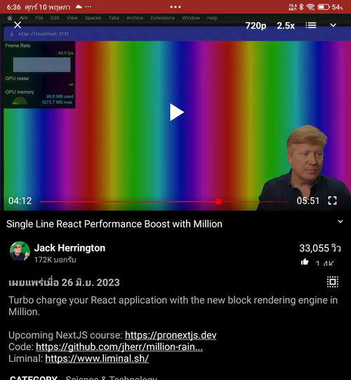
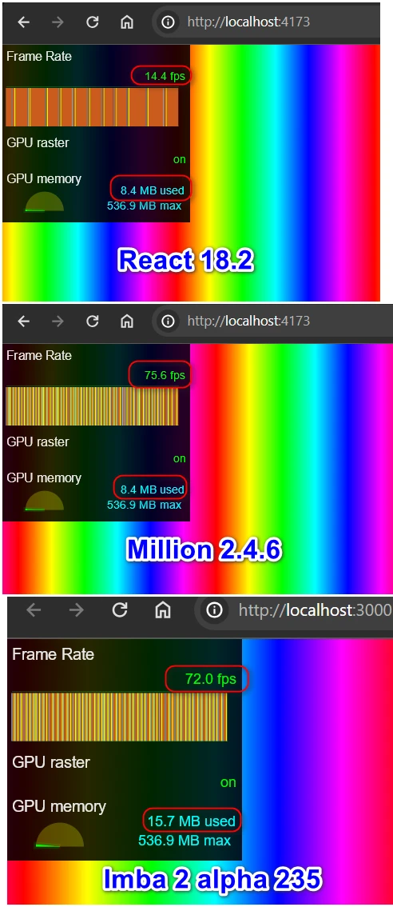

# imba-million-rainbow

implement [Jack Herrington's million rain demo](https://github.com/jherr/million-rainbow) in imba

## how do i
- [x] make a div with full height
- [x] make many div with different hue
- [x] click to update list
- [x] animate using auto render (instead of requestAnimationFrame)

## result
- see frame drop in devtools > render > frame rendering stats
- imba is ok to render 1,440 div at 72 frames per second (react is 15 fps)
- fast as million js but use more GPU memory ( 8.4MB vs 15.6MB)
- 

